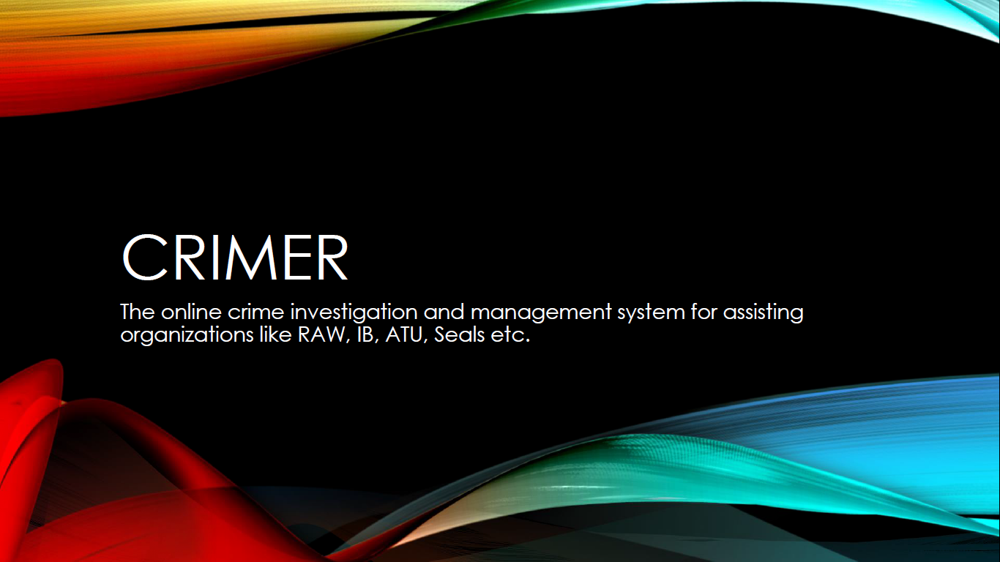
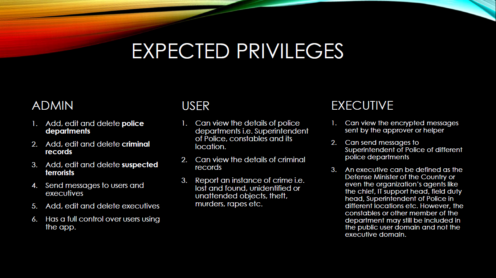

   

#CRIMER
The online crime investigation and management system for assisting organizations like RAW, IB, ATU, Seals etc.

###Name of the Team -> JAVA-D-BUGS

###Member List ->
* [Devesh Tarasia](https://github.com/DEVESHTARASIA "Devesh Tarasia")
* [Harshit Budhraja](https://github.com/harshitbudhraja "Harshit Budhraja")
* [Shubham Agarwal](https://github.com/shubhxotic "Shubham Agarwal")
* [Shaurya Jain](https://github.com/shaurya96 "Shaurya Jain")
* [Akshay Bhardwaj](https://github.com/coolpad-bug "Akshay Bhardwaj")
* [Shobhit Garg](https://github.com/shobhitgarg12 "Shobhit Garg")

##Project Statement
You are required to assist RAW in maintaining the list of criminals, prime suspects for terror attacks, encrypting and decrypting of messages sent between different departments. As the details of RAW are highly secure, it is important that you encrypt the data before storing them in database. While retrieving the data, decrypt and display in the portal. Performing the encryption and decryption is up to your discretion, but RSA and AES algorithms can be used. In case RAW detects a possible terror strike, it needs to be reported to different police departments of that area. For example, in case of suspected strike in Delhi, a message has to be sent to different police departments in Delhi in encrypted manner. An approver or helper of RAW can help in detecting possible attacks in different parts of the country and can send message to RAW which is in encrypted manner. RAW need to decrypt for viewing the message.

There can be 3 modules- 
1. Admin Module 
2. User Module 
3. Executive Module

An admin can add, edit and delete police departments, criminal records and suspected terrorists data in database. Police departments should contain details like who is the SP, constables and location for sending and receiving text or file messages. If you would like to add, you can also store images. For increasing the robustness, you can also compare images of prime suspects for RAW to check if the criminal records matches. User can view the details of police departments and criminal records. An executive can view encrypted messages sent by the approver or helper. Also send messages to different police departments. You are required to develop GUI for viewing and sending messages, storing, editing and deleting records. Also, a database for storing the data.

##Description
* *PLATFORM* for the user system - Android (Java + XML)

* *PLATFORM* for the database – [Buddy](https://buddy.com)

* The current state of the understanding of this project statement demands us to have one separate app for an ADMIN, which has privileges as mentioned in the upcoming slides.

* Parallel to that, we also need to develop another app that can throw up functionalities for a PUBLIC USER as well as an EXECUTIVE PERSONNEL of the organization using our system, privileges from whom is also explained in the upcoming slides.

* We should have a database that should store the information required by the system, which we plan to create using the Buddy platform. The data stored in this database can be viewed and used by both the user and executive domains, but the sole authorizations to maintain, add, edit and delete it, lies with the administrator of the organisation handle in this system. 

###Expected Privileges

